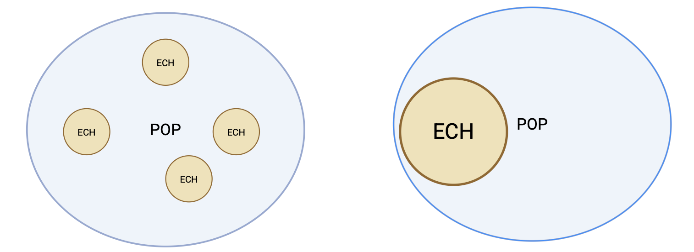

# Test statistique ($\chi^2$)

**Pourquoi faire des tests statistiques ?**

Faire des tests statistiques permet de donner un cadre objectif à l’interprétation des résultats expérimentaux. En effet, lorsqu’on observe une différence entre deux groupes ou une corrélation entre deux variables, il peut être difficile de savoir si cette observation reflète un phénomène réel ou simplement le fruit du hasard. 

Le test statistique répond à cette question en quantifiant la probabilité d’obtenir un tel résultat si aucune relation véritable n’existait. Autrement dit, il permet d’**évaluer si l’événement observé est rare — et donc digne d’attention car peu compatible avec l’hypothèse de hasard — ou au contraire commun, et alors probablement sans signification particulière**. 

> Ainsi, les tests statistiques offrent un outil essentiel pour distinguer les signaux réels des fluctuations aléatoires, et donc pour fonder les conclusions scientifiques sur une base rigoureuse.

## Observation/Expérience/causalité (quelques mots de vocabulaire)

### Échantillons/populations

Une population comprend tous les individus ou objets d’intérêt. Les données sont collectées à partir d’un échantillon, qui est un sous-ensemble de la population.

*Exemple : pour estimer quel est le risque d’effet  secondaire dans le traitement du cancer de la prostate par radio-thérapie, des chercheurs ont mené une étude sur une cohorte de plus de 300 patients. Pendant 5 ans après le traitement, ils ont surveillé la survenue d’effets secondaires. Ils ont trouvé que 35% de ces personnes ont souffert d’effets secondaires.*

Quelle est l’échantillon dans cette étude ?

Qu’est-ce qu’une population raisonnable à laquelle nous pourrions généraliser les conclusions de l’étude ? 
Ceci est indispensable à garder à l'esprit. En effet, les études sont menées sur des échantillons QUI DOIVENT ÊTRE REPRÉSENTATIF DE LA POPULATION. Dans ce context, il est possible d'inférer les résultats.

L’**inférence statistique** est le processus d’utilisation des données d’un échantillon pour obtenir des informations sur la population. *Exemple : "On infère sa moyenne."* 

> Attention : le choix de l'échantillon peut-être biaisé et les conclusions de l'étude ne pourraient être généralisées à l'ensemble de la population.

Par rapport au graphique ci-contre, prenez le temps de vous informer sur les processus d'échantillonage possibles, leur point fort et leur point faible.



### Données/individu/variables

En statistique, les données issues d’un échantillon, sont rangées de telle sorte que :

- chaque ligne correspond à un(e) individu/observation.

- chaque colonne correspond à une variable.

Elles sont rangées dans un tableau que nous nommerons désormais une matrice $X_{ij}$ avec $i$ pour les individus/observations (lignes) et $j$ pour les variables (colonnes).

### Méthodologie d'analyse

La première étape lorsque vous réalisez une analyse est de décrire les données. Quels types de données ? Quels types de variables ? Comment peut-on représenter le problème biologique de manière visuel ?

Pour rappel (Chapitre 1), il existe principalement deux types de variables : 

- Les variables quantitatives (ex : un taux de cholesterol).

- Les variables qualitatives (ex : des stades de cancers).

La représentation visuelle et les statistiques associées seront totalement différentes. La visualisation dépendra du type de la variable à décrire et du problème associé. 

Pour chacune des problématiques que nous présenterons dans ce cours, il faudra déployer cette **méthodologie** : 

(1) Définir la(es) variable(s) à visualiser. 

(2) Définir un graphique permettant de visualiser le problème.

(3) Décrire numériquement les variables. Estimer des paramètres de l'échantillon ?

(4) Poser les hypothèses statistiques.

(5) Réaliser un test statistique pour valider ou refuser l'hypothèse nulle.

(6) Conclure en restant objectif(ve) par rapport aux résultats.

***

## Test statistique avec 2 variables qualitatives.

### Statistiques descriptives et visualisations

Dans le code ci joint, nous importons des données que nous stockons dans une 
table de type `data.frame`, concernant des sportifs de Haut niveau (SHN) et leur type de microbiote intestinaux. 

Dans cette étude les auteurs souhaitaient savoir si les SHN présentaient des microbiotes intestinaux différents de ceux des sujets Non-athlètes (NA).

Autrement dit la variable "SHN" présente si les individus (observations) sont des Sportifs de Haut Niveau (TRUE) ou non (FALSE, i.e. non athlètes). La variable "Type" prend deux valeurs soit 1 soit 2, qui définit le type de microbiote intestinal que possède l'individu. Brievement, les individus ayant un microbiote de type 1 possèdent des espèces bactériennes similaires et différents de ceux du type 2. Inversement pour les microbiote de type 2.

Les données peuvent être téléchargées [**ici**](https://github.com/DJrMartin/bookdown_applied_statistics/blob/main/data/SHN-microbiote.csv).

- Quelles sont les types des variables ?

La première étape est de transformer la matrice en table de contingence (table à double entrée) où sont répertoriées des données de comptage entre deux variables qualitatives.

```{r, warning = FALSE}
df <- read.table("data/SHN-microbiote.csv", sep=",", header=T, stringsAsFactors = T, encoding = 'latin1', row.names=1)
knitr::kable(table(df))
```

**Questions**

(a) Pouvons-nous utiliser ces données pour déterminer si le sport influence la composition du microbiote intestinal ? Attention au verbe utilisé dans la phrase !

(b) Quelle est la population d’intérêt ?

> Cette question est l'une des plus importantes puisqu'elle conditionnera votre capacité à faire des conclusions à partir de votre analyse (**inférence statistique**). Il faut toujours se poser la question de comment a été echantillonné votre jeu de données et représente-t'il la population d'intérêt que vous souhaitez étudier. En statistique, on travaille souvent sur des échantillons. Dans ce cadre, on dira toujours qu'un paramètre (e.g. moyenne, variance, etc...) est estimé et on y ajoutera un chapeau. Ainsi, une probabilité estimée s'écrira $\hat{p}_{j}$ ou une moyenne s'écrira $\hat{\mu}_{j}$ pour une variable $j$.

(c) Quelle est la proportion de SHN dans la population ($\hat{p}_{SHN}$) ? Proportion de SHN qui présente un microbiote de type 2 ($\hat{p}_{SHN|M=2}$) ? Proportion de NA (Non Athlètes) qui possède un microbiote de type 2 ($\hat{p}_{NA|M=2}$) ?

(d) Trouver et interpréter $\hat{p}_{SHN}$ − $\hat{p}_{NA}$, la différence de proportion entre SHN et NA.

La proportion est une statistique qui aide à décrire la variable catégorielle pour ce groupe de jeunes hommes. Nous voyons que la proportion de SHN est égale à 58%. Une proportion (ou probabilité) se situera toujours entre 0 et 1 (ou bien 0 et 100%).

(e) Comment peut-on représenter cette probabilité ? Utiliser la fonction pie(). *Vous avez toujours la possibilité d'aller de demander l'aide de R.*

```{r, fig.width=4, fig.height=4, fig.align='center', fig.cap="Figure 2 : Représentation en camembert des proportions de SHN vs NA au sein de l'échantillon étudié."}
SHN_NA <- c(sum(df$SHN==TRUE),sum(df$SHN==FALSE)) ## (1) Faire la somme des SHN et NA, peu importe le type de microbiote intestinal et (2) l'enregister dans un nouvel objet R.

par(mar=c(0,0,0,0)) # Permet de conditionner les marges du plot.
pie(SHN_NA, labels = c("SHN", "NA"), col=c("firebrick","cornflowerblue")) ## Utiliser la fonction pie.
```

Le **problème** sous jacent est donc le suivant : Est-ce que la proportion de SHN est la même dans le groupe des microbiote de type 1 que dans le groupe des microbiote de type 2 ? Cette question porte sur la relation entre les deux variables, et non l'influence.

> ATTENTION : Assurez-vous de lire attentivement les questions lorsque vous utilisez une table à double entrée. Les questions ”Quelle proportion de SHN possède un microbiote de type 1 ? ” Et ” Quelle est la proportion de microbiote de type 1 parmi les SHN» semblent similaires mais posent des questions différentes.

Quel graphique pour repondre à la question du problème ? Que peut-on dire ? Peut-on conclure ? Causalité ?

```{r, fig.width=10, fig.height=4, fig.align='center', fig.cap="Figure 3 : (1) Représentation des proprotions de SHN/NA (rouge/bleue) en fonction du type de microbiote (2) Représentation des types de microbiote (vert foncé/vert clair) en fonction du niveau de sport."}
df.proportion.Sport <- apply(table(df), 2, function(x) {x/sum(x)}) # je calcul les proportions en ligne.
df.proportion.Microbiote <- apply(table(df), 1, function(x) {x/sum(x)}) # je calcul les proportions en colonne.

layout(matrix(c(1,2,3), nrow=1)) # permet de réaliser une fenêtre graphique à 3 cases
barplot(as.matrix(df.proportion.Sport), col=c("firebrick","cornflowerblue"), xlab="Type de Microbiote") # premier plot
barplot(as.matrix(df.proportion.Microbiote), col=c("darkgreen","green"), xlab="Sports")  # second plot

plot.new() # j'ajoute un troisième plot vide pour pouvoir placer la légende.
legend("center",c('SHN', 'NA', "Type 1", "Type 2"), 
       fill=c("firebrick","cornflowerblue","darkgreen","green"), bty="n")
```

> Dans notre cas les deux graphiques ne sont pas différents de par la structure de notre table de contingence mais il pourrait l'être donc pensez à faire les deux graphiques/plot pour ne pas manquer les informations. 

> N'OUBLIEZ JAMAIS QUE RELATION NE SIGNIFIE PAS CAUSALITÉ.

### Explication des Tests Statistiques

#### Généralités

> Un test statistique (ou test d’hypothèses) utilise des données d’un échantillon pour décider entre deux hypothèses concernant une population en contrôlant le risque de se tromper.

Dans notre exemple où nous avons 2 variables qualitatives, nous souhaitons répondre à la question suivante : La proportion de SHN est la même dans les individus présentant un microbiote de type 1 que dans le groupe des individus présentant un microbiote de type 2.

Pour estimer la probabilité d'une dépendance entre deux variables qualitatives, vous pourrez utiliser le test du $\chi^2$. Son rôle est d'estimer et comparer la répartition des fréquences des modalités observées par rapport à une répartition théorique. 

Cette répartition théorique dépend de la question de recherche posée. La valeur de $\chi^2$ identifie la probabilité que la répartition observée diffère de la répartition théorique **sous l'hypothèse nulle **, en fonction du nombre de degrés de liberté ($dl, k$).

**Hypothèse nulle $H_0$**, en pratique, on commence par étudier ce qui se passe sous l’hypothèse correspondant au cas où il n’y pas de différence. On pose $H_0$ qui se lit "Hypothèse nulle" où les deux variables sont indépendantes (ici, le fait d'être sportif est indépendant du type de microbiote **OU BIEN** le type de microbiote intestinal est indépendant du faite d'être sportif de haut niveau).

**Hypothèse alternative $H_1$ **, dans l’hypothèse alternative, on indique que les variables sont dépendantes.

Hypothèse nulle ($H_0$) : Prétendre qu’il n’y a pas d’effet ou pas de dépendance.

Hypothèse alternative ($H_1$) : Revendication pour laquelle nous recherchons des preuves significatives.

L’hypothèse alternative est établie en observant les preuves (données) qui contredisent l’hypothèse nulle et soutiennent l’alternative hypothèse.

#### Erreurs liées à la prise de décision (p value)

On fait une erreur quand on se trompe de conclusion. Il y a 2 façons de se tromper :

- Lorsque que l'on rejette $H_0$ alors que $H_0$ vraie : Erreur de Type 1 (Faux positifs)

- Lorsque que l'on ne refuse pas $H_0$ alors que $H_0$ fausse : Erreur de Type 2. (Faux négatifs)

On sait estimer la probabilité de se tromper quand on rejette $H_0$ (i.e. p.value).

> A retenir, dans un test statistique, vous calculez deux paramètres : la statistique du test et la p value. Plus la p value tend vers 0 et plus le phénomène est rare sous $H_0$. Le degré de signification (ou p-value) nous donne un moyen formel de mesurer la "force" de la preuve qu’un échantillon fournit contre l’hypothèse nulle et à l’appui de l’hypothèse alternative. Autrement dit, **la p value nous informe sur le risque que l'on prend à rejetter $H_O$ à tort**. 

Dans le cas du test du $\chi^2$, par exemple, plus le phénomène est rare sous $H_0$ et plus la dépendance entre deux variables qualitatives est importante.

### Test Statistique pour variables qualitatives ($\chi^2$)

Le test du $\chi^2$ va comparer les fréquences observées (O=observed) avec les fréquences attendues (E=expected) si H0 est correcte ou si nous choississons l'hypothèse alternative avec les taux d'erreurs associés. 

Si nous repartons de notre tableau de contingence, nous avons observons les répartitions ci contre. 

| Sports // type | 1     |2      |**Total** |
| :--------------|:-----:|:-----:|---------:|
| NA             | 3     |18     | 21       |
| SHN            | 18    |11     |29        |
|**Total**       | 21    |29     |50        | 

**Question** Quels sont les probabilités attendues (Expected) **sous H0**? Nous observons que notre population se compose à 58% de SHN donc si les variables était totalement indépendantes on s'attendrait à avoir 58% de SHN dans chacun des types de microbiote intestinaux. On peut prendre le problème dans l'autre sens, nous observons 42% de microbiote de type 1, on devrait retrouver ce microbiote chez 42% des SHN et chez 42% de NA.

**Réponse** Etant donné que nous observons 21 microbiotes de type 1 (sur l'ensemble de notre échantillon) sur 50 individus, la probabilité $\hat{p}_{T1}$ est égale à 42% (ou 0.42), la théorie veut que 42% des SHN (0.42 x 29) et 42% des NA se trouvent dans la colonne 1 correspondant aux individus possédant un microbiote de type 1.

| Sports // Type | 1             |2        |
| :--------------|:-------------:|:-------:|
| NA             | 21 x 0.42 = 8.82     |21 x 0.58 = 12.18|
| SHN            | 29 x 0.42 = 12.18   |29 x 0.58 = 16.82|

**Question** Faites la même chose en faisant le raissonnement à partir du niveau de sports ? 

Le calcul de la statistique se définit donc par l'écart entre la répartition observée et la répartition théorique soit : 

$$\chi^2 = \sum_{j,k} {\frac{(O_{j,k}-E_{j,k})^2}{E_{j,k}}} $$

```{r}
print(chisq.test(df$SHN, df$Enterotype))
```

> Il faut retenir que le test du $\chi^2$ se base sur la différence entre ce que l'on observe et ce que l'on devrait observer sous $H_0$.

**Conclusion** Que faut-il conclure ? Est-ce que la pratique du sport impacte le type de microbiote intestinal ? ou bien est-ce le type de microbiote intestinal qui permet de devenir un athlète de Haut Niveau ?

## Révisions

### QCM

**1. Le test du chi2 se réalise lorsque les deux variables sont :**  
- [ ] Qualitatives  
- [ ] Quantitatives  

<details>
<summary>Afficher la réponse</summary>
✅ Qualitatives
</details>

---

**2. H0 signifie que les variables sont dépendantes.**  
- [ ] Vrai  
- [ ] Faux  

<details>
<summary>Afficher la réponse</summary>
❌ Faux (H0 : les variables sont indépendantes)
</details>

---

**3. Si la statistique de test du chi2 est grande alors sa p.value sera :**  
- [ ] Faible  
- [ ] Élevée  

<details>
<summary>Afficher la réponse</summary>
✅ Faible
</details>

---

**4. Une variable qualitative possède toujours 2 modalités :**  
- [ ] Vrai  
- [ ] Faux  

<details>
<summary>Afficher la réponse</summary>
❌ Faux (elle peut avoir un grand nombre de modalités)
</details>

---

**5. Une probabilité est comprise entre -1 et 1 :**  
- [ ] Vrai  
- [ ] Faux  

<details>
<summary>Afficher la réponse</summary>
❌ Faux (elle possède une valeur entre 0 et 1)
</details>

---

**6. Ce test statistique se base sur quel paramètre de position :**  
- [ ] Moyenne  
- [ ] Médiane  
- [ ] Quantiles  
- [ ] Aucun  

<details>
<summary>Afficher la réponse</summary>
✅ Aucun
</details>

---

### Questions ouvertes (définitions)

**Quel est le principe du calcul de la statistique de ce test ?**  
<details>
<summary>Afficher la réponse</summary>
Le principe est de comparer les probabilités observées (Observed) et les probabilités attendues (Expected) sous H0 (c’est-à-dire lorsque les variables sont totalement indépendantes).
</details>

---

**Donner la définition de H0 (Hypothèse Nulle) ?**  
<details>
<summary>Afficher la réponse</summary>
L’hypothèse nulle correspond à la situation où il n’existe aucune différence entre les conditions expérimentales ou bien que les groupes de variables étudiés soient indépendants.
</details>

---

**Le refus de H0 implique une prise de risque. Expliquez de manière vulgarisée.**  
<details>
<summary>Afficher la réponse</summary>
Le refus de H0 s’effectue après avoir pris connaissance de la p value.  
Plus la p value tend vers 0, plus le phénomène est rare sous H0.  

La p value mesure le risque que l’on prend à rejeter H0 à tort.  
Exemple : si p = 0.04, rejeter H0 signifie que l’on prend un risque de 4 % de se tromper.
</details>

---

### Problème

#### Énoncé

Vous devez évaluer un jeune médecin qui apprend à classer les individus **SAINS** ou **MALADES**.  
Pour ce faire, vous lui donnez des lames de microscope où se trouvent des biopsies de foie.  
Le médecin doit évaluer l’évolution de la stéatose hépatique (stockage de graisse).  

Vous récupérez ses verdicts sur **200 patients**.  
Vous donnez les mêmes lames à un médecin expérimenté qui les classe à son tour.  

Votre objectif est de savoir si les deux médecins classent de la même manière les patients.  

La classification du médecin expérimenté sont en lignes et celle du jeune médecin en colonnes.  

---

#### Tableau de classification

|               | **SAINS (Jeune)** | **MALADES (Jeune)** |
|---------------|-------------------|----------------------|
| **SAINS (Exp.)**   | 90                | 5                    |
| **MALADES (Exp.)** | 10                | 95                   |

---

**Décrivez de manière littéraire la première case en haut à gauche.**  
<details>
<summary>Afficher la réponse</summary>
La case bleue nous donne le nombre de patients qui sont classés comme étant SAINS par les deux médecins.
</details>

---

**Quelle est la probabilité d’être classé MALADES par le médecin expérimenté lorsque le jeune médecin classe les patients comme étant MALADES ?**  
<details>
<summary>Afficher la réponse</summary>
95 / (10+95) = **95 %**
</details>

---

**Quelle est la probabilité d’être classé SAINS par le jeune médecin lorsque le médecin expérimenté les classe comme étant MALADES ? Que pouvez-vous dire de l’évaluation du jeune médecin ?**  
<details>
<summary>Afficher la réponse</summary>
5 / (5+95) = **5 %**  
→ Le jeune médecin se trompe dans 5 % des cas en sous-classant des malades en sains.
</details>

---

**Définir H0 ? Puis définir H1 ?**  
<details>
<summary>Afficher la réponse</summary>
- H0 : Les deux classifications effectuées par les médecins sont indépendantes (dissimilaires).  
- H1 : Les deux classifications effectuées par les médecins sont dépendantes (proches).
</details>

---

**Calculer les probabilités de classification du jeune médecin sous $H_0$ ?**  
<details>
<summary>Afficher la réponse</summary>
- SAINS : 47,5 %  
- MALADES : 52,5 %
</details>

---

**Calculer la statistique de test du $\chi^2$ pour la case en bas à droite ?**  
<details>
<summary>Afficher la réponse</summary>
Statistique de test = $\frac{\left(\tfrac{95}{100} - \tfrac{105}{200}\right)^{2}}{\tfrac{105}{200}}$
</details>

---

**La statistique du test définit une p value proche de 0.01. Conclure.**  
<details>
<summary>Afficher la réponse</summary>
On rejette H0 au seuil de 5 %, donc les deux médecins classent de manière significativement proche.
</details>


## Travaux Pratiques

### Pokemons

Appliquer l'ensemble des analyses du chapitre sur un jeu de données concernant les Pokemons provenant de https://www.data.gouv.fr/fr/datasets/jeu-de-donnees-sur-les-pokemons/. Je vous mets à disposition une table à double entrée où sont présentés deux variables : (1) Le pokémon possède 1 ou 2 types (Roche, Eau, Feu, Plantes, etc...) et (2) le pokémon possède une évolution (Oui ou Non).

Les données (pour créer ce tableau à double entrée) peuvent être téléchargées [**ici**](https://github.com/DJrMartin/bookdown_applied_statistics/blob/main/data/pokemons.csv).

| Evolution // nb de type | 1 type   |2 types  |
| :-----------------------|:--------:|:-------:|
| Oui                     | 51       |59       |
| Non                     | 64       |41       |

(a) Quelles sont les variables ?

(b) Poser $H_0$ et $H_1$ ?

(c) Réprésenter les résultats sous forme de graphique ?

(d) Définir l'erreur de type 1 ?

(e) Quelle conclusion ?

### Travaux Pratiques

Dans ce premier TP, votre objectif sera de déterminer le nombre d'heures de sports à réaliser par semaine associé avec un risque faible de développer une pathologie cardiovasculaire.

L'objetif sous jacent de ce TP est de se familiriser avec la simulation des données par conséquent toutes les conclusions seront scienfitiquement infondées.

Pour avoir accès à des résultats scientifiques fondés sur ce sujet, je vous invite à lire la review suivante : [AHAJournal](https://www.ahajournals.org/doi/full/10.1161/JAHA.115.002495).

**Votre objectif est donc de déterminer un seuil concernant la pratique d'AP.**

#### Partie simulation

0) Définir une seed à 12 avec la fonction set.seed()

```{r}
set.seed(2)
```

1) Définir un nombre de sujets à 200 que vous enregistrerez dans un objet n.

```{r}
n <- 200
```

2) Simuler pour les n sujets un nombre d'heures de sport par semaine, grâce à une loi de poisson avec un lamdba de 4.2. Nous ajouterons un bruit gaussien.

```{r}
PA <- rpois(n, 4.2)+rnorm(n, 0, 1)
```

3) Quelle type de variable ?

4) Visualiser l'hétérogénéité de la variable activité physique, i.e. PA.

5) Définir un risque de développer une pathologie cardiovasculaire. La variable Risk comprendra 2 modalités ("Pas de risque" et "risque"). Vous devrez la créer à partir d'une loi binomiale où la probabilité de ne pas développer de risque (i.e. Pas de risque = 1) sera proportionnelle au niveau d'activité physique. 

Utiliser la fonction rbinom() pour introduire une probabilité de développé une pathologie cardiaque | nb heures de sport.

```{r}
Risk <- NULL
for(i in 1:n){
  Risk <- c(Risk, rbinom(1, 1, PA[i]/10+(0.1)))
}
# Renommer la variable Risk (R) pour que le 1 soit égal à pas de risque.
# Renommer la variable Risk (R) pour que le 0 soit égal à risque.
Risk[Risk==1]="Pas_de_risque" ; Risk[Risk==0]="risque"
```

6) Quelle type de variable ?

#### Partie test statistique

7) Visualiser les données ensemble.

```{r}
boxplot(PA~Risk)
```

8) Quelle est la probabilité d'avoir un risque de développer une pathologie cardiaque en fonction de la pratique du sport ?
  a) Réaliser une boucle pour nb_PA étant le nombre d'heure de sport allant de 1 à 8 heures par semaine pour déterminer la probabilité d'avoir un risque de développer une pathologie cardiaque.

```{r}
P_risk = NULL
for (nb_PA in 1:8){
  P_risk <- c(P_risk, table(data.frame(Risk, PA>=nb_PA))[2,2]/sum(table(data.frame(Risk, PA>=nb_PA))[,2]))
}
```


  b) Réaliser un graphique de la prababilité du risque en fonction de la pratique d'activité physique.

```{r}
plot(P_risk~c(1:8), ylim=c(0,1))
```

9) Quel seuil pourrions vous définir ?

10) Utiliser le test du CHI2 pour vous aider à prendre une décision. Définir les hypothèses du test ? 
À quelle réponse serions nous capable de répondre ?

--> Est-ce que la proportion de sujet actif (seuil choisi) est la même dans le groupe "risque" que dans le groupe "pas de risque" ? 

> Cette question porte sur la relation entre les deux variables.

  a) Réaliser une boucle pour nb_PA étant le nombre d'heure de sport allant de 1 à 8 heures par semaine pour déterminer la statistique de test et la p value du test du CHI2

```{r}
p.value = statistique = NULL
for (nb_PA in 1:8){
  statistique <- c(statistique, chisq.test(table(data.frame(Risk, PA>=nb_PA)))$statistic)
  p.value <- c(p.value, chisq.test(table(data.frame(Risk, PA>=nb_PA)))$p.value)
}
```

  b) Réaliser un graphique de la statistique du test en fonction de la pratique d'activité physique en colorant les points en fonction de la p.value.

```{r}
plot(statistique~c(1:8), col=p.value<0.05)
```

  c) Dans quelle condition les variables sont les plus dépendantes entre elles. 

```{r}
which.min(p.value)
```

  d) Visualiser la table de confusion à l'aide de la fonction barplot() avec le seuil choisi en ajoutant les résultats du test statistique (statistique du test + p value).

11) Que peut-on conclure ?
