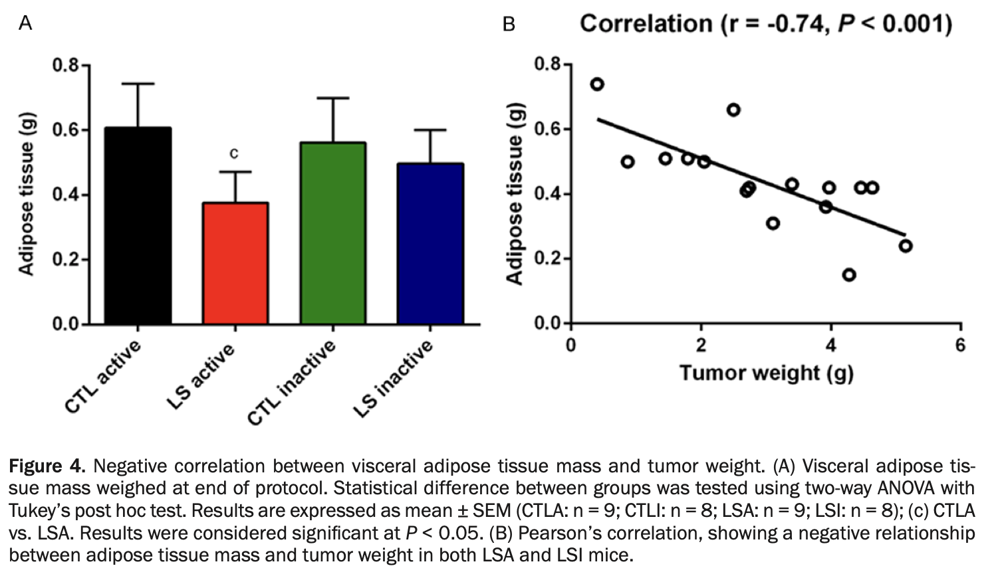

# Tests statistiques (ANOVA et Kruskal Wallis)

## Tests statistiques pour plusieurs groupes

Pour ce cours nous prendrons un autre exemple concernant le potentiel de stockage du carbon au niveau du **sol** en fonction des types de climats/territoire. Importer les données avec le code suivant : 

```{r}
load(file="data/Carbon-Storage.rda")
colnames(Carbon_storage)
```

La matrice présente quatre variables, une variable sur le type de climat/biome sur lequel a été évalué le stockage de carbon, la seconde variable correspond au type de terrain où a été réalisé le prélévement (par exemple, forêt ou terrain agricôle). Enfin, la troisième variable correspond au stockage de carbon actuel et la dernière variable concerne le stockage potential. La somme des deux dernières colonnes correspond donc à la capacité du biome à stocker du carbon.

Dans les démonstrations qui vont suivre, nous nous intéresserons uniquement à la capacité actuelle et au trois biomes suivant : "Subtropical", "Temperate" et "Boreal".

(a) Sélectionner ces trois types de biome et la variable "Current". Enregister le tout dans un nouvel objet.

(b) Représenter la capacité actuelle en fonction des 3 biomes.

```{r, fig.width=6, fig.height=4, fig.align='center', fig.cap="Figure 1 : Représentation du potentiel de stockage en fonction des biomes."}
w <- which(Carbon_storage$Biome=="Subtropical"|Carbon_storage$Biome=="Polar"|Carbon_storage$Biome=="Boreal")
df <- data.frame("Biome"= Carbon_storage$Biome,"Current"=Carbon_storage$Current)[w,]
df = droplevels.data.frame(df)
boxplot(Current~Biome, df, outline=F, col=c("darkgreen", "tomato", "gold"))
```

La question de recherche est maintenant de savoir s'il y a une différence dans le stockage de carbon (mesuré en 2022) entre ces trois biomes.

> De la même manière que les tests statistiques que nous avons vu dans les cours 2 et 3, nous devons verifier en amont si la variable pour chacun des groupes respecte la normalité et une variance égale.

(c) À l'aide de la fonction shapiro.wilk() et bartlett.test(), vérifier la normalité de la variable dans les trois biomes et si leurs variances sont proches.

```{r}
for(biome in unique(df$Biome)){
  SW <- shapiro.test(df$Current[which(df$Biome==biome)])
  print(paste("Le test de Shapiro.Wilk renvoie une statistique de", round(SW$statistic, 2), "et un p value associée de", SW$p.value, "pour le biome suivant", biome))
}
```

(d) Que conclure sur la normalité de la variable en fonction des groupes ?

```{r}
bartlett.test(Current~Biome, df)
```

(e) Que conclure sur l'égalité des variance de la variable entre les groupes ?

(f) Vers quelle famille de test statistique allez-nous nous tourner pour répondre à notre question biologique ?

### Test non paramétrique (**Kruskall-Wallis**)

Le test de Kruskall-Wallis permet de comparer la position de 3 échantillons ou plus, $x_1 = \{x_{11},··· ,x_{1n_1}\} , ···, x_k = \{x_{k1},··· ,x_{kn_k}\}$.

$H_0 : \hat{\theta}_1 =\hat{\theta}_2=\hat{\theta}_k$ contre au moins une des $\theta$ est différent des autres ($H_1$). Pour rappel $\theta$ est un paramètre, ici la distribution d'une variable pour un groupe $k$.

> Le test de Kruskall-Wallis fait une analyse de la variance non paramétrique. On l’utilise pour les petits échantillons ou quand l’hypothèse de normalité n’est pas vérifiée.

La statistique de test est donnée par 

$$S_{KW}=  \frac{12}{n(n+1)} \sum_{i=1}^k \frac{R_{i.}^2}{n_i}-3(n+1)$$

où $n=\sum_{i=1}^k n_i$ est le nombre total d'observation et $R_{i.}$ est la somme des rangs de l'échantillon $i$.

La loi de la statistique de test est tabulée pour les petits échantillons. Pour les grands échantillons, la statistique de test suit une loi du $\chi^2$ à$ k − 1$ degrés de liberté́. En présence, d’ex aequo, il existe une formule ajustée.

```{r}
kruskal.test(Current~Biome, df)
```

Que pouvez vous dire par rapport aux résultats du test statistique et à la probabilité d'observer ce résultat ?

### Test paramétrique (**ANOVA**)

#### Normalisation 

Nous ne pouvons pas utiliser les précédentes données pour un test statistique À MOINS DE TRANSFORMER CES DONNÉES, de les normaliser. La transformation des données permet en outre de pouvoir utiliser des tests statistiques paramétriques (qui possèdent une puissance plus importante que les tests non paramétriques).

Plusieurs transformations existent. Nous en verrons deux à travers ce cours. La normalisation en centrant et réduisant les données (nous verrons cela lors du prochain cours) et la normalisation par transformation des données selon une échelle logarithmique (i.e. la fonction log() dans R).

```{r, fig.width=6, fig.height=4, fig.align='center', fig.cap="Figure 2 : Représentation du stockage actuelle (log transformé) en fonction des biomes."}
boxplot(log(Current)~Biome, df, col=c("darkgreen", "tomato", "gold"))
```

(a) Quelles sont vos remarques ?

(b) Refaire le test de normalité et d'égalités des variances.

```{r}
for(biome in unique(df$Biome)){
  SW <- shapiro.test(log(df$Current[which(df$Biome==biome)]))
  print(paste("Le test de Shapiro.Wilk renvoie une statistique de", round(SW$statistic, 2), "et un p value associée de", SW$p.value, "pour le biome suivant", biome))
}
```

```{r}
bartlett.test(log(Current)~Biome, df)
```

(c) Que pouvons-nous conclure ?

> Attention il ne faut pas uniquement regarde la probabilité d'observée cet événement (p.value), la statistique est très importante et aide à prendre des décisions.

#### ANOVA à effet fixe (1 facteur)

Pour comprendre l’ANOVA (ANalysis Of VAriance), il faut bien caractériser les variables du problème pour ne pas faire d’erreur dans la formule. 

(1)	Le Biome est une variable considérée comme qualitative avec trois modalités bien déterminées. Nous l’appelons le facteur. Ici, le facteur " Biome " est à effets fixes.

(2)	Le stockage actuel du Carbone au niveau des sol est considérée comme quantitative car obtenus par une mesure (analyse d’image). Nous l’appelons la variable réponse.

> L’analyse de la variance permet de répondre à la question : "Y a-t-il un effet biome sur les stockages de carbone au niveau des sol ?"

L’**analyse de la variance** (ANOVA) est une méthode statistique qui permet d’étudier la modification de la moyenne $\mu$ d’une quantité $Y$ (variable réponse quantitative) selon l’influence éventuelle d’un ou de plusieurs facteurs d’expérience qualitatifs (ici biome) : le facteur $X$. Le facteur X est souvent une variable qualitative présentant un nombre restreint de modalités. On note $J$ le nombre de modalités (ici $J=3$).

Le modèle de l’analyse de la variance s’écrit : 

$ Y_{i,j} = \mu + \alpha_j+\varepsilon_{i,j} $ pour $i = 1, …, I$ et $j = 1, …, J$ où

$Y_{i,j}$ est la valeur de la variable réponse $Y$ (i.e. sockage de carbon) pour l'observation $i$ dans la modalité (niveau, i.e. biome) $j$.

$\mu$ est l'effet moyen.

$\alpha_j$ est l'effet différential de la modalité $j$ (i.e. d'un biome).

$\varepsilon_{i,j}$ est le terme d'erreur aléatoire.

```{r, fig.width=5, fig.height=4, fig.align='center', fig.cap="Figure 3 : Représentation graphique du modèle de l'Analyse des Variances. La ligne en blue correspond à la moyenne globale du modèle. Les points rouges correspondent à la somme de la moyenne globale + l'effet différentiel (moyenne des groupes)."}
cnt=1
boxplot(log(Current)~Biome, df, col=c("darkgreen", "tomato", "gold"))
abline(h=mean(log(df$Current)), col="cornflowerblue", lwd=2, lty="dashed")
for(biome in unique(df$Biome)){
  points(x=as.numeric(unique(df$Biome))[cnt],y=mean(log(df$Current[which(df$Biome==biome)])), pch=16, cex=1, col="red")
  cnt=cnt+1
}
```

**Estimation des paramètres du modèle**

L'estimation des paramètres sur R se réalise grâce à la fonction lm(). La première qui consistait à savoir quelle variable était Y et laquelle était X est très importante puisqu'elle permet de bien écrire le modèle. Ce que nous tenter de modéliser, c'est bien le stockage de carbone actuel en fonction de la variable fixe : biome. Dans R, le mot "en fonction" s'écrit **~**. Ainsi la formule dans R sera : 

```{r}
summary(lm(log(Current)~Biome, data=df))
```

(a) Décortiquer les résultats du modèle. Identifier la moyenne de la variable en fonction des groupes ?

L'intercept dans ce modèle est le biome "Boreal". Mais non pouvons écrire un modèle sans intercept.

```{r}
summary(lm(log(Current)~0+Biome, data=df))
```

(b) Décortiquer les résultats du modèle. Identifier la moyenne de la variable en fonction des groupes ?

**Test d'hypothèse** 

L’analyse de la variance est souvent utilisée pour tester l’égalité des moyennes.

Hypothèses de test

$H_0 : \mu_1 = \mu_2 = … = \mu_J$ contre $H_1$ : au moins une des moyennes est différente.

ou bien (de manière équivalente) :

$H_0 : \alpha_1 = \alpha_2 = … = \alpha_J = 0$ contre $H_1$ :au moins un $\alpha_j$ est différent de zéro.

On pourrait dire pour notre exemple de biome : 

- Les trois biomes stocke la même quantité de carbone (en moyenne).

- Les effets différenciels des trois biomes sont nuls.

Rejeter $H_0$ s’interprète de la manière suivante : (1) Deux niveaux différents du facteur $X$ entrainent une différence significative de la variable réponse $Y$. (2) Le facteur $X$ a un effet significatif sur la variable réponse $Y$.

**Statistique de l'ANOVA**

La statistique de test se base sur les différences observées entre les moyennes des échantillons (variance inter-groupe) et les différences entre les observations à l’intérieur des échantillons (variance intra-groupe). On s’intéresse au rapport entre la variance expliquée par les facteurs (ici biome) et la variance des résidus intra-groupe.

Dans ce cas, nous prendrons comme notation : 

**SCT** (Somme des Carrés Totale) traduit la variation totale de Y.

**SCE** (Somme des Carrés Expliquée) traduit la variation expliquée par le modèle.

**SCR** (Somme des Carrés Résiduelle) traduit la variation inexpliquée par le modèle.

et nous avons la relation :

$$SCT=SCE+SCR$$

```{r, fig.width=10, fig.height=3, fig.align='center', fig.cap="Figure 4 : Représentation graphique du modèle de l'Analyse des Variances avec la variance totale, la variance intergroupe et la variance intragroupe. La ligne en blue correspond à la moyenne globale du modèle. Les points rouges correspondent à la somme de la moyenne globale + l'effet différentiel (moyenne des groupes). Les lignes vertes correspondent à la variance intragroupe."}
ylim=range(log(df$Current))
layout(matrix(c(1,2,3,3,3),nrow=1))
par(mar=c(4,4,3,2))
cnt=1
boxplot(log(df$Current), ylim=ylim, main="Variance totale (SCT)", ylab="Carbon Storage")
abline(h=mean(log(df$Current)), col="cornflowerblue", lwd=1, lty="dashed")

plot(x=1, y=1, col="white", ylim=ylim, ylab="Carbon Storage", axes=F, xlab="", main="Variance intergroupe (SCE)")
for(biome in unique(df$Biome)){
  points(x=1,y=mean(log(df$Current[which(df$Biome==biome)])), pch=16, cex=1, col="red")
  cnt=cnt+1
}
axis(2)
box()
abline(h=mean(log(df$Current)), col="cornflowerblue", lwd=1, lty="dashed")

plot(x=as.numeric(df$Biome), y=log(df$Current), ylim=ylim, xlim=c(0.5, 3.5),
     ylab="Carbon Storage", axes=F, xlab="", main="Variance intragroupe (SCR)")

cnt=1
for(biome in unique(df$Biome)){
  segments(x0=as.numeric(unique(df$Biome))[cnt]+0.1,
         y0=mean(log(df$Current[which(df$Biome==biome)]))-sd(log(df$Current[which(df$Biome==biome)])),
         y1=mean(log(df$Current[which(df$Biome==biome)]))+sd(log(df$Current[which(df$Biome==biome)])), 
         col="green3", lwd=2)
  cnt=cnt+1
}
axis(2)
box()
abline(h=mean(log(df$Current)), col="cornflowerblue", lwd=1, lty="dashed")
```

On utilise la statistique de test 

$$F_n = \frac{SCE/(J − 1)}{SCR/(n − J)}$$

SCE/(J − 1) est la part de variance de $Y$ expliquée par le modèle (i.e. par les modalités/facteurs $X$),

SCR/(n − J) est la part résiduelle de variance $Y$.

Plus $F_n$ est grande et plus on s'écarte de l'hypothèse nulle. Autrement plus la distance entre les points rouge augmente ET/OU la variance résiduelle (intragroupe) diminue, plus grande sera la statistique F.

```{r}
# ANOVA
model_estimation <-lm(log(Current)~Biome, data=df)
anova(model_estimation)
```

La p value du test est très petite devant 5% d'erreur, nous pouvons dire qu'il existe un effet significatif de la modalité (biome) sur la variable réponse $Y$ (stockage de carbone).

#### ANOVA à effet fixe (2 facteurs)

EN TP.

***

## Tests statistiques Multiples.

### Généralités

Si plusieurs hypothèses sont testées, la probabilité́ d’un évènement rare augmente et, par conséquent, la probabilité́ de rejeter de manière incorrecte une hypothèses nulle (c’est-à-dire commettre une erreur de type I) augmente. Dans ce cas là, l'hypothèse nulle rejetée serait un faux résultat positif.

La correction de Bonferroni compense cette augmentation en testant chaque hypothèse à un niveau de signification (ou de risque) de $\alpha /k$ ou $\alpha$ est le niveau global souhaité et $k$ le nombre d’hypothèses.

Dans l’exemple précèdent, on a 3 groupes et donc $k = 3$. Si on fait les comparaisons multiples au risque 5%, on doit comparer chacune des p.values à 0.05/3. Le nouveau seuil de significativité serait 0.017.

Sinon, cela revient à multiplier les p-values par k ($k=3$ dans l’exemple) et comparer les p-value « corrigées » au seuil initialement fixé (par ex. 0.05). Aussi appelé test de Dunn. 

### Applications

Dans le cas de nos Biome, nous souhaitons les comparer 2 à 2 et savoir comment ils diffèrent entre eux par rapport à leur capacité à stocker du Carbon. 

**1) Correction de Bonferroni**

L'idée est de réaliser des tests wilcoxon entre deux biomes et estimer la p.value. 

```{r}
for(i in unique(df$Biome)[1:2]){
  for(j in unique(df$Biome)[2:3]){
    if(i!=j){
      X <- df$Current[which(df$Biome==i)]
      Y <- df$Current[which(df$Biome==j)]
      print(paste(i, "Versus", j))
      print(wilcox.test(X, Y)$p.value)
    }
  }
}
```

(a) Entre quelles biomes observons nous des capacités de stockages différentes ?

(b) Même question en applicant la correction de Bonnferroni ? 

**2) Test de Dunn**

On applique directement la correction de Dunn sur le script de notre boucle en multipliant la p.value de chaque test par le nombre de tests réalisés (ici $k=3$).

```{r}
for(i in unique(df$Biome)[1:2]){
  for(j in unique(df$Biome)[2:3]){
    if(i!=j){
      X <- df$Current[which(df$Biome==i)]
      Y <- df$Current[which(df$Biome==j)]
      print(paste(i, "Versus", j))
      print(wilcox.test(X, Y)$p.value*length(unique(df$Biome)))
    }
  }
}
```

(a) Entre quelles biomes observons nous des capacités de stockages différentes ?

## Révisions des tests

### QCM

**1. L’ANOVA se réalise lorsqu’il y a une variable quantitative et uniquement une variable qualitative.**  
- [ ] Vrai  
- [ ] Faux  

<details>
<summary>Afficher la réponse</summary>
❌ Faux
</details>

---

**2. Quelles phrases sont correctes ?**  
- [ ] On accepte H0 lorsque la p value est inférieure à 0.05  
- [ ] On rejette H1 lorsque la p value est inférieure à 0.05  
- [ ] Le seuil de significativité est modifié lorsque vous utilisez la correction de Dunn sur des tests multiples  
- [ ] Le Kruskal-Wallis est un test non paramétrique  

<details>
<summary>Afficher la réponse</summary>

✅ On rejette H0 lorsque la p value est inférieure à 0.05.

✅ Le seuil de significativité est modifié avec la correction de Dunn.

✅ Le Kruskal-Wallis est un test non paramétrique.
</details>

---

**3. L’ANOVA à 2 facteurs se réalise lorsque le problème inclut 2 variables quantitatives et 1 variable qualitative.**  
- [ ] Vrai  
- [ ] Faux  

<details>
<summary>Afficher la réponse</summary>
❌ Faux (L’ANOVA à 2 facteurs se réalise avec **2 variables qualitatives** et **1 variable quantitative**)
</details>

---

**4. Combien d’$H_0$ l’ANOVA à 2 facteurs peut-elle tester ?**  
- [ ] 1  
- [ ] 2  
- [ ] 3  
- [ ] 4  

<details>
<summary>Afficher la réponse</summary>
✅ 3
</details>

---

### Questions ouvertes (définitions)

**Définissez H0 (Hypothèse Nulle) lorsque vous réalisez un test du Shapiro-Wilk.**  
<details>
<summary>Afficher la réponse</summary>
H0 : La variable étudiée suit une loi normale.
</details>

---

**Quelle est la différence entre variable qualitative et modalité ?**  
<details>
<summary>Afficher la réponse</summary>

- La **variable qualitative** est une variable catégorielle qui décrit une qualité/attribut.  

- Une **modalité** est l’une des catégories que peut prendre cette variable.  
Exemple : Variable = « couleur », modalités = rouge, bleu, vert.  
</details>

---

**Expliquez de manière vulgarisée, en vous appuyant sur la formule de l’ANOVA à 1 facteur, comment elle fonctionne.**  
<details>
<summary>Afficher la réponse</summary>

- Le **numérateur** de la statistique de test correspond à la variabilité **entre les moyennes des groupes**.  

- Le **dénominateur** correspond à la variabilité **intra-groupe** (résiduelle).  

- La statistique augmente si :  
  1. Les moyennes des groupes sont très différentes.  
  2. Les dispersion intra-groupes est faible (faible écart-type).  
</details>

---

### Problème

Les auteurs d’une publication (*Am J Cancer Res 2017;7(5):1037-1053*) testent deux variables qualitatives avec deux modalités chacune :

- **Santé** : CTL (contrôle) vs LS (cancéreux)  
- **Environnement** : Inactive vs Active  

Ils mesurent la **masse du tissu adipeux viscéral** (moyenne ± SEM).
Les résultats sont disponibles sur cette figure : 



---

**Décrire le graphique.**  
<details>
<summary>Afficher la réponse</summary>
Le graphique compare la masse adipeuse des souris selon une condition de santé (contrôle ou cancéreuse) et selon l’activité (active ou inactive). Visuellement, il semblerait qu'il y ait des différences  entre les groupes.  
</details>

---

**À partir du graphique, quels tests préconisez-vous ?**  
<details>
<summary>Afficher la réponse</summary>
Une **ANOVA à 2 facteurs** (santé × environnement).  
</details>

---

**Donner les $H_0$ associées à ce graphique (questions biologiques).**  
<details>
<summary>Afficher la réponse</summary>
**$H_0$ (1)** La masse du tissu adipeux est identique quelle que soit la modalité de la variable **environnementale** (active vs inactive).  

**$H_0$ (2)** La masse du tissu adipeux est identique quelle que soit la modalité de la variable **santé** (contrôles vs cancéreuses).  

**$H_0$ (3)** La masse du tissu adipeux n’est pas influencée par l’**interaction** entre santé et environnement.  
</details>

---

**Au vu du graphique, quelles $H_0$ rejetteriez-vous ?**  
<details>
<summary>Afficher la réponse</summary>
On rejette **$H_0$ (2)** → la masse adipeuse est différente selon la santé (contrôle vs cancéreuse).  
</details>

## Travaux pratiques

Durée : 3h

Nous utiliserons pour l'ensemble des prochains TPs un jeu de données issu d'une étude réalisée dans la Station Spatial Internationale. L'ensemble des résultats est déjà publiées dans cet article : https://link.springer.com/article/10.1007/s12217-018-9653-2. L'ensemble des données est téléchargeable sur la plateforme de la NASA : https://osdr.nasa.gov/bio/repo/data/studies/OSD-546.

```{r}
rm(list=ls()) # Permet de supprimer les objects et fonctions enregister sur l'environnement.
```

Objectifs : explorer les conséquences de la microgravité (i.e. pas de pesanteur) sur le métabolisme du fer dans des Hematopoïetic Stem Cell en condition de différenciation cellulaire (HSC vers osteoblastes).

1) Importer les données

```{r}
df <- read.table(file = "data/TPs/iron_metabolism_RNA_TP.csv", sep=";", header = T)
load("data/TPs/meta_data.rda")
```

2) Définir les 4 conditions expérimentales. Montrer la matrice de confusion

```{r}
table(meta_data[,2:3])
```

Définir les conditions de ground versus Space ?

Définir les conditions de osteogenic versus Standard. Lire le papier pour être au clair avec les conditions. 

4) Faire un petit récapitulatif de comment fonctionne le métabolisme du fer au niveau intra-cellulaire. Nous pourrons appuyer nos résultats sur de la littérature existante : https://faseb.onlinelibrary.wiley.com/doi/10.1096/fj.202301184R

5) définir n et p.

```{r}
n <- length(meta_data$ID) # Nombre d'individus
p <- dim(df)[1] # Nombre de variables
```


### Statistiques descriptives du metabolisme du fer

6) Visualiser l'effet du macro-environnement sur chaque expression d'ARNm.

```{r}
layout(matrix(c(1:p), nrow = 4, byrow=T))
par(mar=c(2,4,2,2))
for(i in 1:p){boxplot(as.numeric(df[,-c(1,2)][, meta_data$ID][i,])~as.factor(meta_data$Macro_env), main=(df$SYMBOL)[i], xlab="", ylab="ARN expressions")}
```

  a) Que peut-on dire ?
  b) Quelles seraient les hypothèses H_O et H_1 ?
  c) Les données sont-elles normales et/ou possèdent une variance similaire entre les groupes ?

7) Visualiser l'effet du micro-environnement sur chaque expression d'ARNm.

```{r}
layout(matrix(c(1:p), nrow = 4, byrow=T))
par(mar=c(2,4,2,2))
for(i in 1:p){boxplot(as.numeric(df[,-c(1,2)][, meta_data$ID][i,])~as.factor(meta_data$Micro_env), main=(df$SYMBOL)[i], xlab="", ylab="ARN expressions")}
```

  a) Que peut-on dire ?
  b) Quelles seraient les hypothèses H_O et H_1 ?
  c) Les données sont-elles normales et/ou possèdent une variance similaire entre les groupes ?

8) Réaliser des correlations entre les variables pour vérifier le fonctionnement du métabolisme du fer.

9) Faire la même figure en ajoutant des couleurs pour les conditions.

### Tests Statistiques

10) Quels tests statistiques utiliser ?

11) via une boucle for() réaliser l'ensemble des tests ? 
  a) pour déterminer l'effet de la vit D3 sur l'expression des ARNm ?
  b) pour déterminer l'effet de la microgravité sur l'expression des ARNm ?

12) a) Quelle est la probabilité de faire une erreur de type I ?
    b) Appliquer une correction ? Dunn ou Bonferroni ? 

13) Que peut-on dire de l'effet de la VIT D3 ? Que peut-on dire de l'effet de la microgravité (espace) sur le métabolisme du fer dans les HSC/osteoblastes ?

### Modelisation à 2 facteurs

14) Peut-on utiliser l'AnOVa à 1 facteur ?

15) Comprendre comment fonctionne l'AnOVa à 2 facteurs ? Ainsi que l'interaction ?

16) Explorer les données en utilisant l'AnOVa à 2 facteurs ?

17) Conclure.

